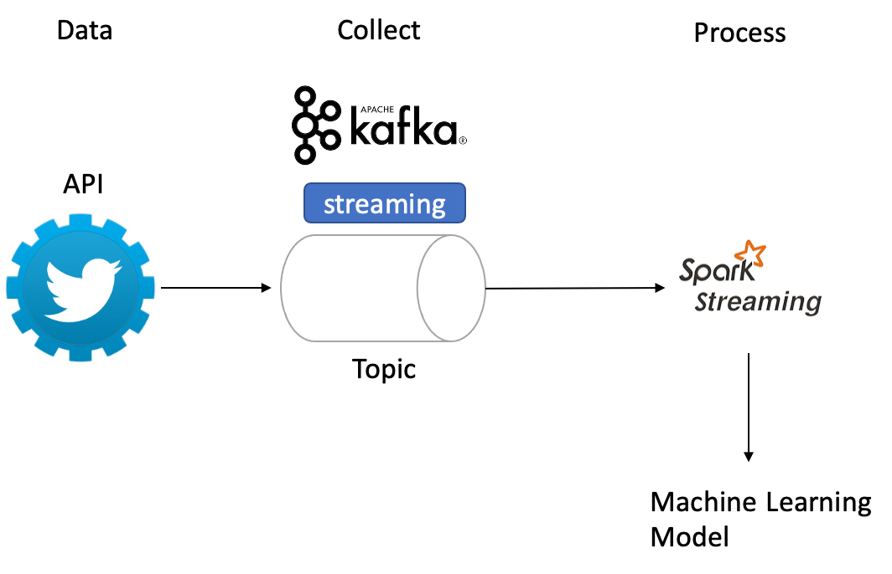

# twittersentimentanalysis

This project is a good starting point for those who have little or no experience with Kafka & Apache Spark Streaming.

Input data: Live tweets with a keyword
Main model: Data preprocessing and apply sentiment analysis on the tweets
Output: Text with all the tweets and their sentiment analysis scores (polarity and subjectivity)

I use Python version 3.6.13 and Spark version 3.2.1 and Kafka 3.1.0.
I also add jar to spark/jars:
- spark-streaming-kafka-0-10-assembly_2.12-3.2.1.jar
- mongodb-driver-sync-4.6.0.jar
- bson-4.6.0.jar
- commons-pool2-2.11.1.jar
- mongodb-driver-core-4.6.0.jar
- mongo-spark-connector-10.0.0.jar
- mongo-spark-connector_2.12-3.0.1.jar
- spark-streaming-kafka-0-10-assembly_2.12-3.2.1.jar

## Part 1: Ingest Data using Kafka 

This part is about sending tweets from Twitter API. To do this, follow the instructions in my last article about the ingestion of Data using Kafka. Here is the [link](https://lorenagongang.com/getting-started-with-kafka-twitter-streaming-with-apache-kafka).

## Part 2: Tweet preprocessing and sentiment analysis
In this part, we receive tweets from Kafka and preprocess them with the pyspark library which is python's API for spark. We then apply sentiment analysis using textblob; A python's library for processing textual Data. I wrote an article on sentiment analysis [sentiment analysis ](https://lorenagongang.com/sentiment-analysis-concept-bitcoin-sentiment-analysis-using-python-and-twitter). I used the same code in this project.

After sentiment analysis, we write the sentiment analysis scores in the console. We have also the possibility to store in a parquet file, which is a data storage format.

[My source](https://lorenagongang.com/sentiment-analysis-on-streaming-twitter-data-using-kafka-spark-structured-streaming-and-python-part-2#cl0t834y700ktk0nva86shg11)

